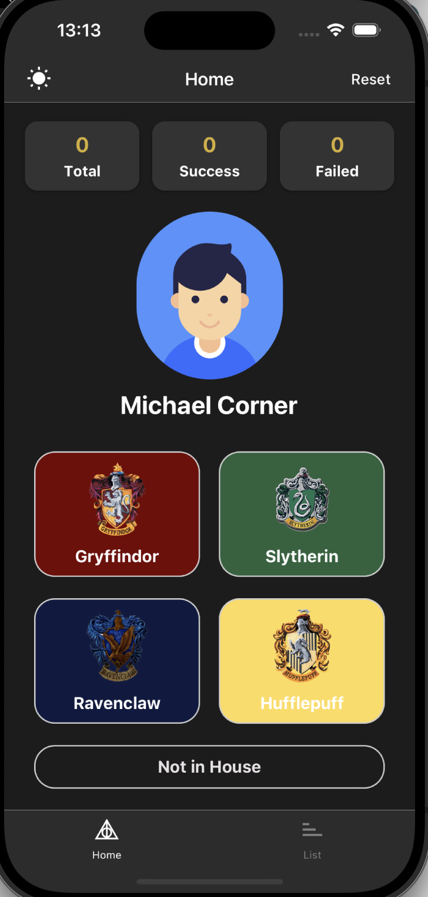
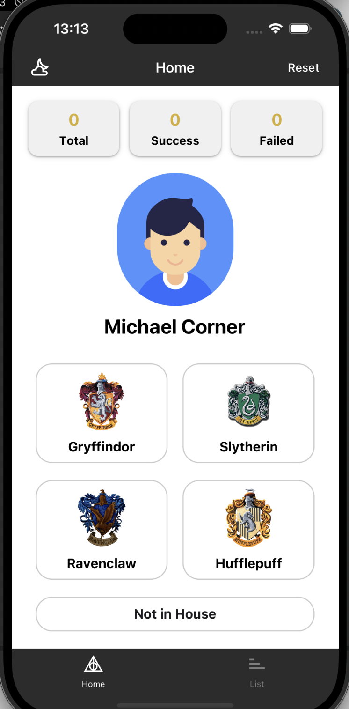
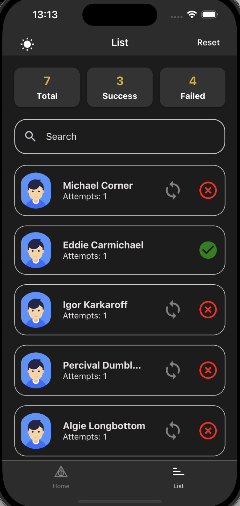
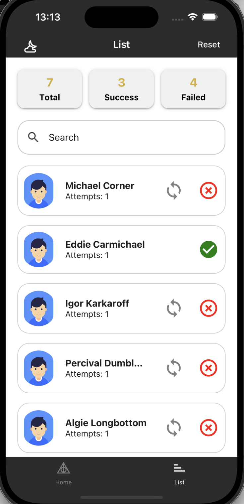
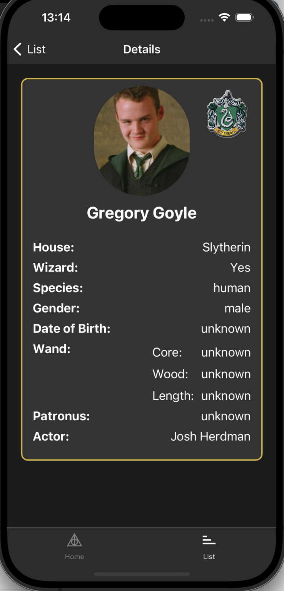
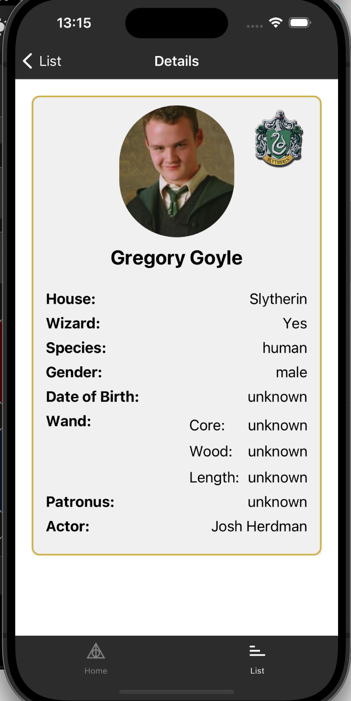
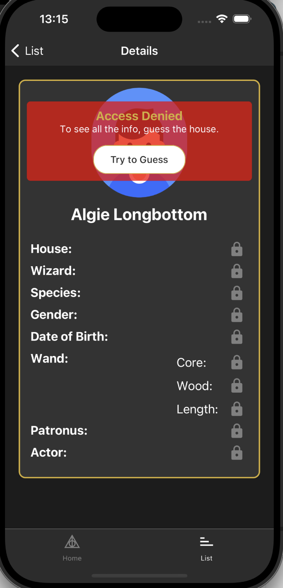

# Hogwarts Sorting Magic Hat Mobile Application

Hogwarts Sorting Magic Hat Mobile Application is a fun app where users try to guess the Hogwarts House of random characters from the Harry Potter universe. It tracks your successful and failed attempts while providing a smooth user experience with character details and a House-guessing challenge.

## Features

The app includes:

- **Random Character Guessing:** Users are presented with a random character to guess their Hogwarts House.
- **House Buttons:** Guess the character’s House with easy-to-click buttons for each House (Gryffindor, Slytherin, Ravenclaw, Hufflepuff) and an option for **Not in House**.
- **Pull-to-Refresh:** Pull down to get a new random character at any time.
- **Detailed Character Information:** Dive into character details such as name, species, and more, once the correct guess is made.
- **Counters for Attempts:** Track the total number of guesses, successful attempts, and failed attempts.
- **History of Guesses:** View a list of previously guessed characters and retry failed guesses.

## Screenshots

## Tech Stack

This app is built using the following technologies:

- **React Native:** For building cross-platform mobile apps.
- **Redux Toolkit:** For managing global state, including character data, guesses, and app settings.
- **TypeScript:** For type-safe JavaScript.
- **React Navigation:** For navigating between screens (Bottom Tabs).
- **React Native Paper:** For UI components like buttons, activity indicators, and cards.
